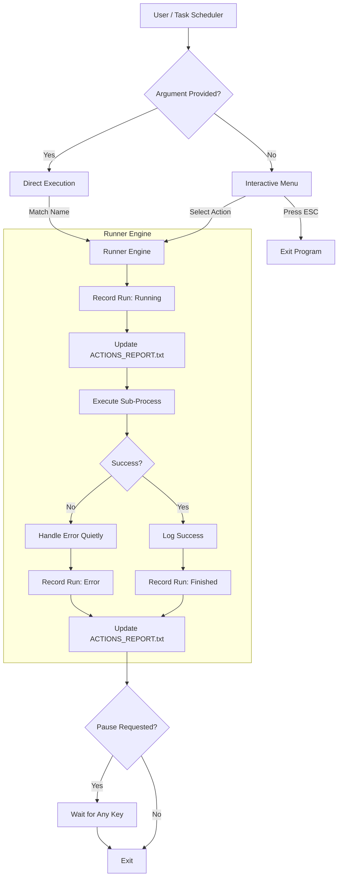

# actions-manager

A centralized TypeScript Node.js actions manager designed to replace scattered `.bat` scripts and simplify Windows Task Scheduler automation. It provides a single entry point for running various automation tasks, tracking their execution history, and generating comprehensive status reports.

Built with TypeScript and modern ES Modules, this project focuses on reliability, maintainability, and providing a great developer experience for local automation workflows.

## Features

- **One bat file** (`actionsManager.bat`) replaces everything on your desktop.
- **Interactive dropdown** when run manually (no argument) powered by `enquirer`.
- **Direct execution** when called by Windows Task Scheduler (with action name as argument).
- **Automatic history** — every run (success or fail) is logged to `data/history.json` and `ACTIONS_REPORT.txt` on your Desktop.
- 🚀 **Centralized Execution**: Single entry point for all project actions via `actionsManager.bat`.
- 🕒 **Execution Tracking**: Automatically records the last execution time and run type (Manual vs. Task Scheduler) for every action.
- 📊 **Status Reporting**: Generates a real-time report for at-a-glance monitoring.
- 🛡️ **Robust Error Handling**: Suppresses noisy stack traces for expected process failures while preserving them for unexpected crashes.
- 🧪 **Testing Infrastructure**: Full Vitest setup with high coverage requirements (80%+) and automated reporting.
- 🔄 **Modern ESM Architecture**: Built using ES Modules and TypeScript for a future-proof codebase.
- ⌨️ **Keyboard Navigation**: Full support for `Esc` to exit menus and clean terminal interactions.
- 🔇 **Quiet Mode**: Suppresses Node.js deprecation warnings and unnecessary shell noise.

## Getting Started

### Prerequisites

- **Node.js**: v20 or higher recommended.
- **pnpm**: Fast, disk space efficient package manager.
- **TypeScript**: The project uses `tsx` for high-performance execution of TypeScript files.

### Installation

1. Clone the repository:

   ```bash
   git clone https://github.com/orassayag/actions-manager.git
   cd actions-manager
   ```

2. Install dependencies:

   ```bash
   pnpm install
   ```

3. Configure your report path:
   Edit [settings.ts](src/settings.ts) to set your desired `ACTIONS_REPORT.txt` location.

### Quick Start

#### Manual Mode (Interactive)

Run the batch file from your Desktop or the project root:

```bash
./actionsManager.bat
```

You'll see an interactive dropdown listing all available actions. Select one with arrow keys and press `Enter` to run, or `Esc` to exit.

#### Task Scheduler Mode

Point your Task Scheduler task to the batch file and pass the action name as an argument:

- **Program/script**: `C:\path\to\actions-manager\actionsManager.bat`
- **Add arguments**: `actionName` ← the action's `name` field (see table below)
- **Start in**: `C:\path\to\actions-manager`

### Current Actions & Their Arguments

| Action Name (argument)    | Label                    | Schedule |
| ------------------------- | ------------------------ | -------- |
| `dailyEventsBot`          | Daily Events Bot         | Daily    |
| `syncDaily`               | Sync Daily Documents     | Daily    |
| `syncAutoPackagesUpdater` | Auto Packages Updater    | Weekly   |
| `seriesAndMovies`         | Series & Movies          | Manual   |
| `reposScanReporter`       | Repos Scan Reporter      | Weekly   |
| `contactsScanMaintainer`  | Contacts Scan Maintainer | Weekly   |
| `globalPackageUpdater`    | Global Package Updater   | Manual   |

## Configuration

### Project Settings

Edit [settings.ts](src/settings.ts) to manage global configurations:

- `reportPath`: Absolute path where the status report will be generated (e.g., your Desktop).

### Adding New Actions

#### Step 1 — Create the action file

Create `src/actions/myNewAction.ts`:

```typescript
import { ActionDefinition } from '../types';
import { spawnSync } from 'child_process';

const myNewAction: ActionDefinition = {
  name: 'myNewAction', // Unique key used as the Task Scheduler argument
  label: 'My New Action', // Human-readable label
  schedulePeriod: 'Daily', // 'Daily', 'Weekly', 'Monthly', or undefined
  pauseAfterRun: false, // Keep terminal open after manual runs?
  run: async () => {
    const result = spawnSync('pnpm', ['run', 'start'], {
      cwd: 'C:\\Or\\web\\projects\\my-new-project',
      stdio: 'inherit',
      shell: true,
    });
    if (result.status !== 0) {
      throw new Error(`Process exited with code ${result.status}`);
    }
  },
};
export default myNewAction;
```

#### Step 2 — Register the action

Open `src/registry.ts`, import your action and add it to the `actions` array.

## Available Scripts

### Development

```bash
pnpm start          # Run the interactive manager
pnpm dev            # Run in watch mode for development
pnpm lint           # Run ESLint to check code quality
pnpm format         # Format code using Prettier
```

### Testing

```bash
pnpm test           # Run all unit tests and generate coverage report
pnpm test:watch     # Run tests in watch mode
pnpm test:ui        # Open Vitest UI for interactive testing
```

## Project Structure

```
actions-manager/
├── src/
│   ├── actions/          # Individual action implementations
│   ├── __tests__/        # Unit tests and infrastructure tests
│   ├── history.ts        # History tracking and report generation logic
│   ├── index.ts          # Main entry point and CLI logic
│   ├── prompt.ts         # Enquirer-based interactive menu logic
│   ├── registry.ts       # Central registry for all actions
│   ├── runner.ts         # Execution engine for actions
│   ├── settings.ts       # Global project settings
│   └── types.ts          # TypeScript interfaces and types
├── data/                 # Local JSON storage for execution history
├── dist/                 # Compiled JavaScript output
├── actionsManager.bat    # Main Windows entry point
├── vitest.config.ts      # Vitest configuration
├── tsconfig.json         # TypeScript configuration
└── package.json          # Project dependencies and scripts
```

## How It Works



## Architecture Flow

1. **Entry Layer ([index.ts](src/index.ts))**: Determines if the run is manual or scheduled.
2. **Interactive Layer ([prompt.ts](src/prompt.ts))**: Handles user input with `Esc` support.
3. **Execution Layer ([runner.ts](src/runner.ts))**: Manages the lifecycle of an action run.
4. **History Layer ([history.ts](src/history.ts))**: Handles JSON persistence and text report generation.
5. **Action Layer ([actions/](src/actions/))**: Decoupled modules for each specific task.

## License

This application has an MIT license - see the [LICENSE](LICENSE) file for details.

## Author

- **Or Assayag** - _Initial work_ - [orassayag](https://github.com/orassayag)
- Or Assayag <orassayag@gmail.com>
- GitHub: https://github.com/orassayag
- StackOverflow: https://stackoverflow.com/users/4442606/or-assayag?tab=profile
- LinkedIn: https://linkedin.com/in/orassayag

## Acknowledgments

- Built for educational and research purposes
- Respects robots.txt and implements rate limiting
- Uses user-agent rotation to avoid detection
- Implements polite crawling practices

## License

This project is licensed under the MIT License - see the [LICENSE](LICENSE) file for details.
